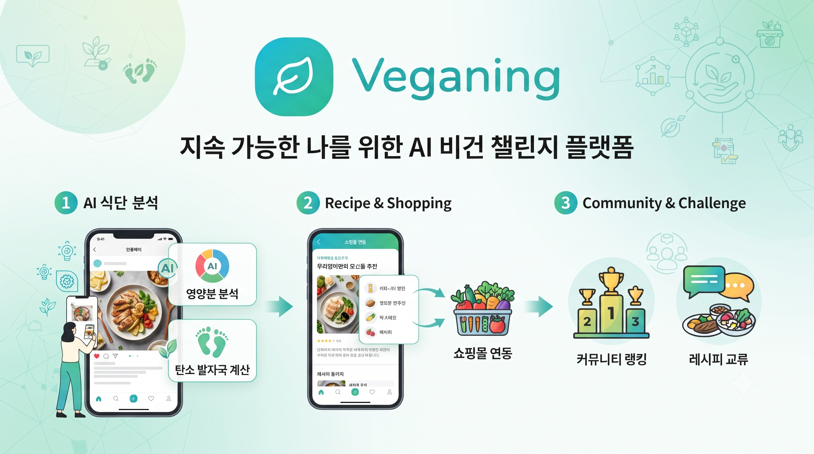
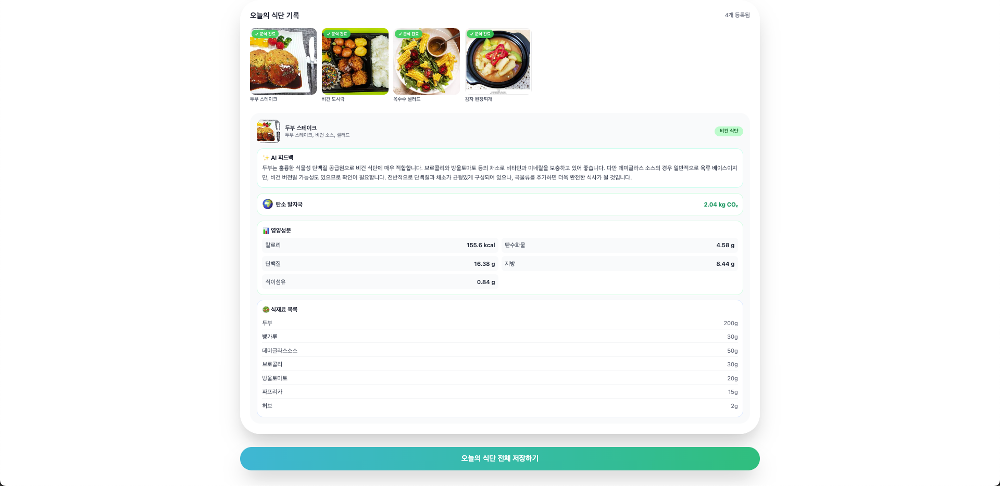
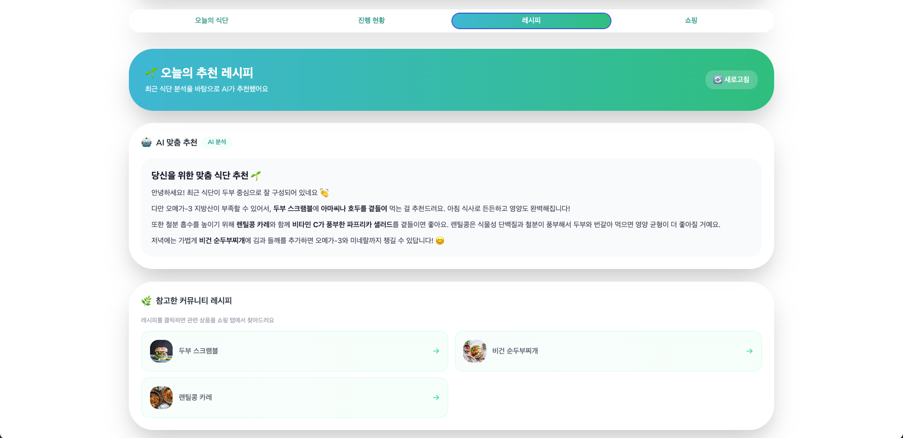
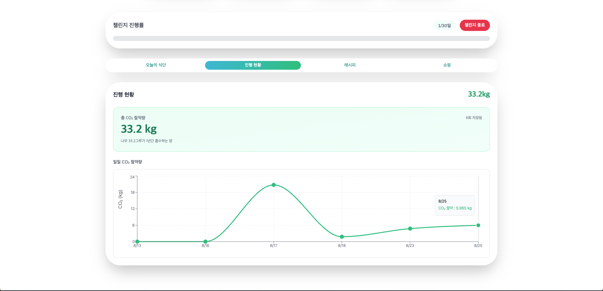
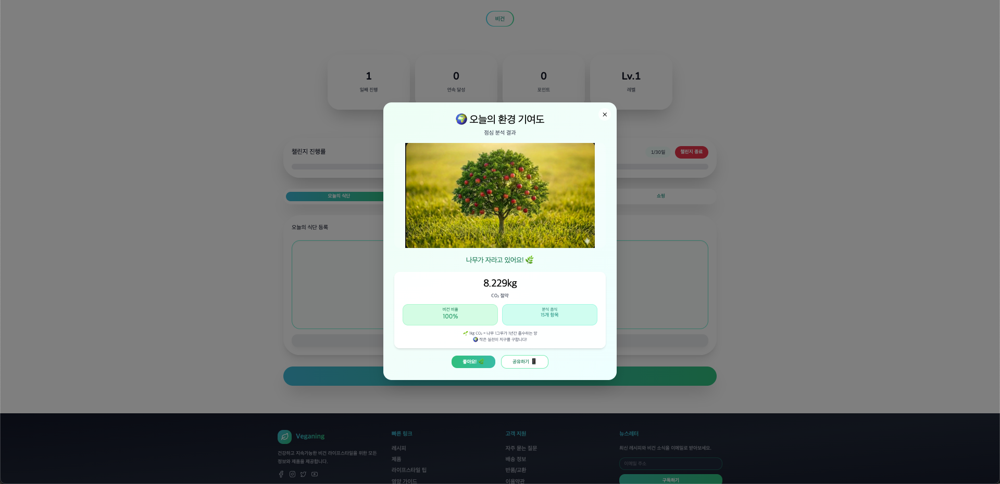
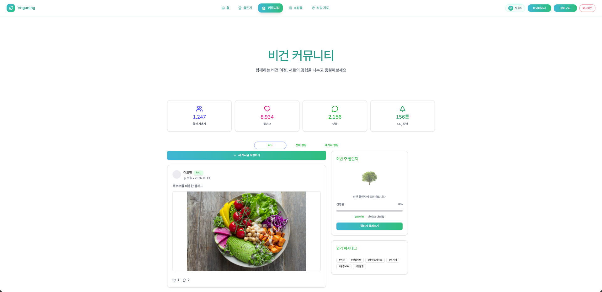
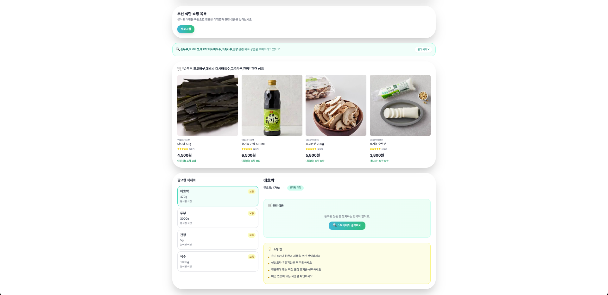
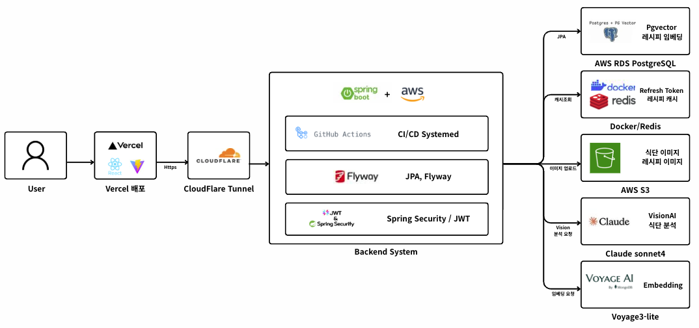
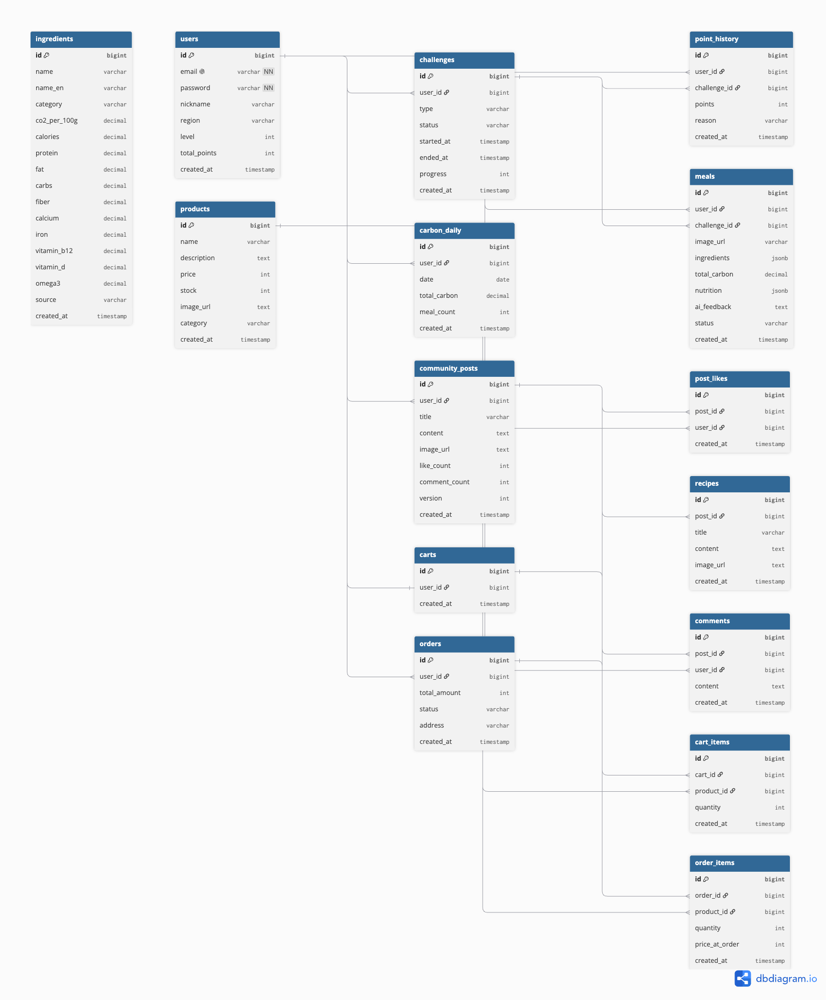

# 🌱 Veganing Backend

<div align="center">



**비건 라이프스타일 챌린지 플랫폼 - Spring Boot 백엔드**

[](https://openjdk.org/)
[](https://spring.io/projects/spring-boot)
[](https://www.postgresql.org/)
[](https://redis.io/)
[](https://aws.amazon.com/)
[](https://github.com/features/actions)
[](http://13.55.162.161:8080/swagger-ui/index.html)

> 프론트엔드 레포: [Veganing Frontend (React 19)](https://github.com/feelow3555/Veganing-frontend) · 🌐 [라이브 데모](https://veganing-frontend.vercel.app)

</div>

---

## 📑 목차

- [프로젝트 소개](#-프로젝트-소개)
- [프로젝트 한눈에 보기](#-프로젝트-한눈에-보기)
- [핵심 기능](#-핵심-기능)
- [시스템 아키텍처](#-시스템-아키텍처)
- [핵심 기술적 의사결정](#-핵심-기술적-의사결정)
- [동시성 및 부하 테스트](#-동시성-및-부하-테스트)
- [트러블슈팅 하이라이트](#-트러블슈팅-하이라이트)
- [ERD](#-erd)
- [패키지 구조](#-패키지-구조)
- [API 목록](#-api-목록)
- [기술 스택](#-기술-스택)
- [프로젝트 결과](#-프로젝트-결과)

---

## 💡 프로젝트 소개

**Veganing**은 비건 라이프스타일을 시작하고 유지할 수 있도록 돕는 챌린지 플랫폼입니다.

매일 식단 사진을 업로드하면 **Claude Sonnet 4 Vision AI**가 식재료를 분석하고, DB에 저장된 데이터를 기반으로 부족한 영양소와 탄소 절감량을 계산합니다.

커뮤니티에서 공유된 레시피는 **Voyage AI + pgvector 기반 RAG**의 데이터로 다시 활용되어 개인 맞춤 식단 추천으로 이어지며, 추천 식재료를 쇼핑 기능까지 연결했습니다.

### 서비스 흐름

```text
비건 챌린지 시작
      ↓
식단 사진 업로드
      ↓
Vision AI 식재료 분석
      ↓
DB 기반 영양소 / 탄소 절감량 계산
      ↓
RAG 기반 개인 맞춤 식단 추천
      ↓
추천 식재료 기반 쇼핑 상품 연결

커뮤니티 레시피 공유
      ↓
좋아요 상위 레시피 선정
      ↓
Voyage AI 임베딩
      ↓
pgvector 저장
      ↓
RAG 추천 데이터로 재활용
```

> 커뮤니티에서 생성된 레시피가 다시 AI 추천 데이터로 활용되는 선순환 구조를 설계했습니다.

### 개발 배경

- 비건 입문자가 영양 불균형 없이 식단을 유지하기 어려운 문제
- 탄소 절감 효과를 수치로 확인하며 챌린지 지속 동기를 높이고자 함
- 커뮤니티 레시피 → AI 추천 → 쇼핑 연결을 통해 비건 생활의 진입 장벽을 낮추고자 함

---

## 🔎 프로젝트 한눈에 보기

| 항목 | 내용 |
|------|------|
| **개발 기간** | 2026.07 ~ 2026.08 (약 3~4주) |
| **담당** | **Spring Boot 백엔드 전체 단독 설계 및 구현** |
| **Backend** | Java 21 · Spring Boot 4.1 |
| **Database** | PostgreSQL 16 · pgvector · Redis |
| **AI** | Claude Sonnet 4 Vision · Voyage AI voyage-3-lite |
| **Infra** | AWS EC2 · RDS · S3 |
| **DevOps** | GitHub Actions · Flyway · systemd |
| **규모** | 15개 테이블 · 8개 주요 도메인 |

### 주요 구현

- 기존 Node.js 프록시 서버를 **Spring Boot 기반 풀 백엔드로 재설계**
- 15개 테이블 ERD 및 도메인 중심 패키지 구조 설계
- Vision AI → DB 정량 데이터 → RAG 추천으로 이어지는 **AI 파이프라인 구축**
- 좋아요와 상품 재고에 **낙관적 락 / 비관적 락을 구분 적용**
- `@Async` + `CompletableFuture` 기반 식단 분석 비동기 처리
- JWT + Refresh Token Rotation 기반 인증 구현
- S3 Presigned URL 기반 이미지 직접 업로드
- EC2 · RDS · S3 배포 및 GitHub Actions 기반 CI/CD 구축
- Flyway 기반 운영 DB 마이그레이션 관리

---

## ✨ 핵심 기능

| 기능 | 스크린샷 |
|------|----------|
| **AI 식단 분석** — Claude Sonnet 4 Vision으로 식재료 추출, DB 기반 영양소/탄소 계산 |  |
| **RAG 식단 추천** — pgvector 코사인 유사도 검색 + Claude로 개인 맞춤 추천 |  |
| **탄소 대시보드** — 일별 탄소 절감량 시각화, 비건 식단만 집계 |  |
| **비건 챌린지** — 30일 챌린지, 포인트/레벨 시스템 |  |
| **커뮤니티** — 레시피 공유, 좋아요(낙관적 락), 지역별 랭킹 |  |
| **비건 쇼핑** — 분석 식재료 기반 상품 추천, 장바구니/주문(비관적 락) |  |

---

## 🏗 시스템 아키텍처



### 식단 분석 흐름

```text
[사용자 식단 사진 업로드]
        ↓
S3 Presigned URL 직접 업로드
        ↓
POST /api/meal
        ↓
202 Accepted + mealId 반환
        ↓
@Async + CompletableFuture
        ↓
Claude Sonnet 4 Vision
        ↓
식재료 목록 추출
        ↓
ingredient 테이블 조회
        ↓
CO2 + 영양소 정량 데이터 조회
        ↓
Claude 피드백 + 부족 영양소 분석
        ↓
meal 저장
        ↓
비건 식단이면 carbon_daily upsert
        ↓
GET /api/meal/{id}
ANALYZING → DONE
```

Claude Vision의 응답 시간이 5~15초까지 소요될 수 있어 HTTP 요청을 계속 대기시키는 대신 **202 Accepted + Polling 방식**으로 설계했습니다.

이미지는 백엔드를 거치지 않고 클라이언트에서 S3로 직접 업로드하도록 구성해 서버의 메모리와 네트워크 사용을 줄였습니다.

### RAG 흐름

```text
[레시피 인덱싱 - 매일 자정]

좋아요 상위 레시피 조회
        ↓
레시피 텍스트
        ↓
Voyage AI voyage-3-lite
        ↓
512차원 벡터 임베딩 생성
        ↓
recipes.embedding (pgvector) 저장
        ↓
Redis 오늘의 레시피 캐시 갱신


[AI 식단 추천]

사용자 식단 분석 결과
        ↓
부족 영양소 + 비건 피드백
        ↓
Voyage AI Query Embedding
        ↓
pgvector 코사인 유사도 검색
        ↓
관련 레시피 Top N
        ↓
레시피 Context + 사용자 데이터
        ↓
Claude Prompt
        ↓
개인화된 식단 추천
```

AWS Bedrock Knowledge Base와 같은 관리형 서비스를 사용하는 대신 **임베딩 생성 → 저장 → 유사도 검색 → LLM Context 구성까지 RAG 전 과정을 직접 구현**했습니다.

---

## 🧠 핵심 기술적 의사결정

### 1. Vision AI — Claude Sonnet 4 선정

식단 이미지에서 식재료를 안정적으로 추출할 Vision 모델을 선택하기 위해 동일한 식단 이미지로 3개 모델을 비교했습니다.

| 항목 | 내용 |
|------|------|
| **후보** | Claude Sonnet 4 · GPT-4o · Gemini |
| **검증 기준** | 식재료 추출 개수 · 정확도 · JSON 응답 안정성 |
| **결정** | **Claude Sonnet 4** |
| **이유** | 테스트 결과 식재료 추출 정확도와 응답 안정성이 가장 우수 |

> 유명한 모델을 바로 선택하기보다 동일한 입력을 기준으로 직접 비교한 뒤 결정했습니다.

---

### 2. RAG — AWS Bedrock KB 대신 pgvector

RAG 구현 방식으로 관리형 서비스와 직접 구현 방식을 비교했습니다.

| 방식 | 장점 | 단점 |
|------|------|------|
| **AWS Bedrock Knowledge Base** | 구축 및 관리가 간편 | 임베딩~검색 과정이 추상화됨 |
| **PostgreSQL + pgvector** | 기존 DB 활용, 전체 과정 직접 제어 | 직접 구현 및 관리 필요 |

최종적으로 **pgvector + Voyage AI voyage-3-lite**를 선택했습니다.

기존 PostgreSQL에 확장만 추가해 별도의 Vector DB를 운영하지 않으면서, 임베딩 생성부터 코사인 유사도 검색까지 전체 흐름을 코드 레벨에서 직접 관리할 수 있다는 점을 우선했습니다.

임베딩 모델 역시 OpenAI `text-embedding-3-small`, AWS Bedrock Titan, Voyage AI `voyage-3-lite`를 비교한 뒤 Voyage AI를 선택했습니다.

---

### 3. 탄소/영양소 계산 — LLM 대신 DB 기반

정확성이 필요한 영양소와 탄소 수치를 LLM이 직접 생성하도록 하지 않았습니다.

```text
Claude Vision
      ↓
식재료 목록 추출
      ↓
ingredient 테이블 조회
      ↓
CO2 + 영양소 정량 데이터
      ↓
Claude Prompt에 실제 수치 제공
      ↓
분석 및 피드백
```

LLM은 식재료 인식과 피드백 생성에 집중시키고, 정확한 수치가 필요한 영역은 DB 데이터를 사용하여 **Hallucination으로 인한 수치 오류 가능성을 줄였습니다.**

---

### 4. 좋아요 — 낙관적 락 / 주문 — 비관적 락

동일한 동시성 문제라도 데이터 특성과 충돌 비용에 따라 서로 다른 전략을 적용했습니다.

```java
// 좋아요: 낙관적 락
@Version
private Long version;

// 주문/재고: 비관적 락
@Lock(LockModeType.PESSIMISTIC_WRITE)
Product findProductById(Long id);
```

**좋아요**

- 충돌 빈도가 상대적으로 낮음
- 응답 성능이 중요
- `@Version` 기반 Optimistic Lock 적용

**주문/재고**

- 재고 정합성 손실 시 초과 판매 발생
- 충돌 시 데이터 손실 비용이 큼
- `PESSIMISTIC_WRITE` 기반 Pessimistic Lock 적용

---

### 5. 식단 분석 — 비동기 처리

Claude Vision API의 응답 시간이 길어질 수 있어 동기 요청 대신 비동기 처리를 적용했습니다.

```text
POST /api/meal
      ↓
202 Accepted
      ↓
@Async Background Processing
      ↓
GET /api/meal/{id}
      ↓
ANALYZING → DONE
```

`@Async` + `CompletableFuture`를 사용했으며, Spring AOP의 Self Invocation 문제를 해결하기 위해 비동기 로직을 `MealAsyncService`로 분리했습니다.

---

### 6. Presigned URL — 서버를 거치지 않는 이미지 업로드

```text
Client
   ↓
Presigned URL 요청
   ↓
Backend
   ↓
URL 발급
   ↓
Client ─────────→ S3
```

대용량 이미지가 백엔드 서버를 직접 통과하지 않도록 S3 Presigned URL을 사용했습니다.

이를 통해 백엔드의 이미지 처리에 필요한 메모리와 네트워크 사용을 줄였습니다.

---

### 7. carbon_daily — 조회 대신 사전 집계

탄소 통계를 조회할 때마다 전체 `meals` 데이터를 집계하지 않고, 식단 분석 완료 시 `carbon_daily`에 일별 절감량을 Upsert하도록 설계했습니다.

```text
Meal 분석 완료
      ↓
비건 식단 여부 확인
      ↓
carbon_daily Upsert
      ↓
Carbon API
      ↓
집계 데이터 바로 조회
```

---

## ⚡ 동시성 및 부하 테스트

> K6 부하 테스트 실측 후 결과 및 그래프 추가 예정

### 좋아요 — Optimistic Lock

- 동일 게시물에 동시 좋아요 요청
- Optimistic Lock 충돌 횟수 확인
- Retry 이후 최종 Like Count 정합성 검증

### 주문 — Pessimistic Lock

- 제한된 재고에 대한 동시 주문 요청
- 성공 / 재고 부족 요청 수 확인
- 최종 재고 및 Overselling 여부 검증

---

## 🔧 트러블슈팅 하이라이트

### #016 — `@Async` 프록시 우회 문제

**문제**

같은 클래스 내부에서 `this.method()` 방식으로 비동기 메서드를 호출하자 `@Async`가 적용되지 않고 동기적으로 실행되었습니다.

**원인**

Spring AOP가 Proxy 기반으로 동작하기 때문에 동일 클래스 내부 호출은 Proxy를 우회한다는 것을 확인했습니다.

**해결**

비동기 로직을 `MealAsyncService`라는 별도 Spring Bean으로 분리해 Proxy를 경유하도록 변경했습니다.

이후 `@Transactional`에서도 같은 원리가 적용된다는 것을 확인하고 `RecipeIndexService` 역시 별도 클래스로 분리했습니다.

**교훈**

`@Async`, `@Transactional`, `@Cacheable`과 같은 AOP 기반 기능을 사용할 때 **호출이 Proxy를 경유하는지 먼저 확인하는 기준**을 갖게 되었습니다.

---

### #059 — JPA와 pgvector 타입 매핑 문제

**문제**

Hibernate가 pgvector의 embedding 컬럼을 일반적인 JPA 타입처럼 처리하지 못하면서 타입 변환 문제가 발생했습니다.

**시도**

`AttributeConverter`를 통한 매핑을 시도했지만 Vector Similarity Query에서 문제가 지속되었습니다.

**해결**

embedding 컬럼을 일반 JPA Entity 매핑에서 제외하고 **Native Query를 통해 벡터 저장 및 검색을 처리**했습니다.

**교훈**

모든 데이터 접근을 JPA로 통일하기보다 ORM의 추상화가 적합하지 않은 영역에서는 SQL을 직접 사용하는 것이 더 명확할 수 있다는 점을 경험했습니다.

---

### #075 — Spring Boot 4.x Flyway 자동설정 미동작

**문제**

`flyway-core` 의존성을 추가했지만 Flyway Migration이 실행되지 않았고 명확한 오류도 발생하지 않았습니다.

**해결**

Spring Boot 4 환경에 맞게 `spring-boot-starter-flyway`로 변경해 자동 설정을 정상화했습니다.

**교훈**

라이브러리가 Classpath에 존재하는 것과 **Spring Boot Auto Configuration이 활성화되는 것은 별개의 문제**임을 확인했습니다.

---

### #082 — Refresh Token 미전달로 토큰 갱신 실패

**문제**

로그인 응답에 Refresh Token이 포함되지 않아 프론트엔드가 Access Token만 저장했고, Access Token 만료 후 정상적인 재발급이 불가능했습니다.

**해결**

`AuthResponse`에 Refresh Token을 추가하고, 토큰 재발급 시 새로운 Refresh Token을 발급한 뒤 Redis 값을 교체하는 **Refresh Token Rotation**을 적용했습니다.

**교훈**

JWT 인증은 Access Token 발급만으로 끝나는 것이 아니라 **발급 → 만료 → 재발급 → 폐기까지 전체 인증 흐름을 기준으로 설계해야 한다는 점**을 경험했습니다.

---

## 🗃 ERD



총 **15개 테이블**을 AUTH, CHALLENGE, MEAL, CARBON, COMMUNITY, RECIPE, PRODUCT, CART, ORDER 도메인으로 분리했습니다.

### 주요 설계

- `community_posts.version` — Optimistic Lock
- `post_likes` — 사용자별 중복 좋아요 방지
- `recipes.embedding` — pgvector 기반 RAG 검색
- `carbon_daily` — 일별 탄소 절감량 사전 집계
- `order_items.price_at_order` — 주문 당시 상품 가격 Snapshot

<details>
<summary><b>15개 테이블 전체 목록 보기</b></summary>

| 테이블 | 도메인 | 설명 |
|--------|--------|------|
| `users` | AUTH | 회원 정보 + 누적 포인트/레벨 + 지역 |
| `challenges` | CHALLENGE | 챌린지 진행 상태 |
| `point_history` | CHALLENGE | 포인트 적립 내역 |
| `ingredients` | MEAL | 식재료별 CO2 + 영양소 기준 데이터 |
| `meals` | MEAL | 식단 업로드 + AI 분석 결과 |
| `carbon_daily` | CARBON | 일별 탄소 절감 집계 |
| `community_posts` | COMMUNITY | 게시물 + Optimistic Lock Version |
| `post_likes` | COMMUNITY | 좋아요 중복 방지 |
| `comments` | COMMUNITY | 댓글 |
| `recipes` | RECIPE | 오늘의 레시피 + pgvector Embedding |
| `products` | PRODUCT | 쇼핑몰 상품 |
| `carts` | CART | 사용자 장바구니 |
| `cart_items` | CART | 장바구니 상품 |
| `orders` | ORDER | 주문 |
| `order_items` | ORDER | 주문 상품 + 가격 Snapshot |

</details>

---

## 📁 패키지 구조

```text
com.veganing
├── domain
│   ├── auth
│   ├── challenge
│   ├── meal
│   ├── carbon
│   ├── ingredient
│   ├── community
│   ├── recipe
│   ├── product
│   ├── cart
│   └── order
│
└── global
    ├── auth
    ├── config
    ├── error
    ├── common
    ├── scheduler
    └── infra
        ├── vision
        ├── voyage
        └── s3
```

기능 전체를 Controller / Service / Repository 계층으로 나누는 대신 **도메인 중심 패키지 구조**를 사용해 관련 코드를 하나의 도메인 내부에서 관리하도록 구성했습니다.

---

## 📋 API 목록

<details>
<summary><b>전체 API 목록 보기</b></summary>

### AUTH

| Method | Endpoint | 설명 | 인증 |
|--------|----------|------|------|
| POST | `/api/auth/signup` | 회원가입 | ❌ |
| POST | `/api/auth/login` | 로그인 | ❌ |
| POST | `/api/auth/logout` | 로그아웃 | ✅ |
| POST | `/api/auth/refresh` | 토큰 재발급 (Rotation) | ❌ |
| GET | `/api/auth/me` | 내 프로필 조회 | ✅ |
| PUT | `/api/auth/profile` | 프로필 수정 | ✅ |

### CHALLENGE

| Method | Endpoint | 설명 | 인증 |
|--------|----------|------|------|
| POST | `/api/challenge/start` | 챌린지 시작 | ✅ |
| GET | `/api/challenge/current` | 진행중인 챌린지 조회 | ✅ |
| GET | `/api/challenge/history` | 챌린지 히스토리 | ✅ |
| GET | `/api/challenge/stats` | 챌린지 통계 | ✅ |
| PUT | `/api/challenge/{id}/quit` | 챌린지 포기 | ✅ |
| POST | `/api/challenge/add-points` | 포인트 추가 | ✅ |

### MEAL

| Method | Endpoint | 설명 | 인증 |
|--------|----------|------|------|
| GET | `/api/meal/upload-url` | S3 Presigned URL 발급 | ✅ |
| POST | `/api/meal` | 식단 분석 요청 | ✅ |
| GET | `/api/meal/history` | 식단 기록 조회 | ✅ |
| GET | `/api/meal/{id}` | 식단 상세 + 분석 상태 | ✅ |
| GET | `/api/meal/recommend` | RAG 기반 식단 추천 | ✅ |

### CARBON

| Method | Endpoint | 설명 | 인증 |
|--------|----------|------|------|
| GET | `/api/carbon/stats` | 전체 누적 통계 | ✅ |
| GET | `/api/carbon/today` | 오늘 절감량 | ✅ |
| GET | `/api/carbon/history?days=N` | 기간별 일별 집계 | ✅ |

### COMMUNITY

| Method | Endpoint | 설명 | 인증 |
|--------|----------|------|------|
| GET | `/api/community/posts` | 게시물 목록 | ❌ |
| POST | `/api/community/posts` | 게시물 작성 | ✅ |
| GET | `/api/community/posts/{id}` | 게시물 상세 | ❌ |
| PUT | `/api/community/posts/{id}` | 게시물 수정 | ✅ |
| DELETE | `/api/community/posts/{id}` | 게시물 삭제 | ✅ |
| POST | `/api/community/posts/{id}/like` | 좋아요 | ✅ |
| GET | `/api/community/posts/{id}/comments` | 댓글 목록 | ❌ |
| POST | `/api/community/posts/{id}/comments` | 댓글 작성 | ✅ |
| DELETE | `/api/community/comments/{id}` | 댓글 삭제 | ✅ |
| GET | `/api/community/ranking` | 지역별 랭킹 | ✅ |

### RECIPE

| Method | Endpoint | 설명 | 인증 |
|--------|----------|------|------|
| GET | `/api/recipe/today` | 오늘의 레시피 목록 | ❌ |

### PRODUCT / CART / ORDER

| Method | Endpoint | 설명 | 인증 |
|--------|----------|------|------|
| GET | `/api/product` | 상품 목록 | ❌ |
| GET | `/api/product/{id}` | 상품 상세 | ❌ |
| GET | `/api/cart` | 장바구니 조회 | ✅ |
| POST | `/api/cart` | 상품 담기 | ✅ |
| PUT | `/api/cart/{cartItemId}` | 수량 변경 | ✅ |
| DELETE | `/api/cart/{cartItemId}` | 상품 제거 | ✅ |
| POST | `/api/order` | 주문 생성 | ✅ |
| GET | `/api/order` | 내 주문 목록 | ✅ |
| GET | `/api/order/{orderId}` | 주문 상세 | ✅ |

</details>

---

## 🛠 기술 스택

### Backend

    

### Database & Cache

  

### AI & Cloud

    

### DevOps

   

---

## 📊 프로젝트 결과

| 항목 | 결과 |
|------|------|
| **개발 기간** | 약 3~4주 |
| **Backend** | Solo |
| **Database** | 15 Tables |
| **주요 도메인** | AUTH / CHALLENGE / MEAL / CARBON / COMMUNITY / RECIPE / PRODUCT / CART / ORDER |
| **Test** | 단위 테스트 48개 |
| **AI** | Vision + Embedding + RAG |
| **Deployment** | AWS EC2 + RDS + S3 |
| **CI/CD** | GitHub Actions |
| **DB Migration** | Flyway |
| **Troubleshooting** | 81건 문서화 |

단순히 API 기능을 구현하는 것을 넘어 **기술 선택의 근거, Spring Framework의 동작 원리, 데이터 정합성을 고려한 동시성 제어, AI 파이프라인 설계, 배포와 운영까지 백엔드 개발의 전체 흐름을 직접 경험**했습니다.

---

<div align="center">

**⭐ Star를 눌러주시면 개발에 큰 힘이 됩니다!**

Made with 🌱 by feelow3555

</div>
